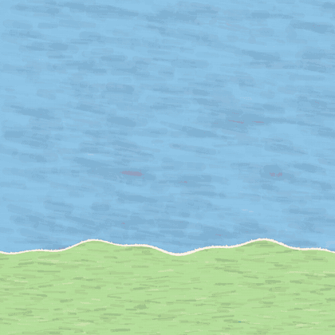

# paper-cut-video

A skill that turns a topic, story, or script into a short animated video in a cut-paper
collage style, with a soundtrack. You give the agent a subject; it writes the storyboard,
draws every shape in code, and renders an MP4.

## Examples

Previews are silent GIFs. Open the MP4 for full quality and sound.

### How bees make honey



16 s, 5 cards · [MP4](examples/honey-bee/honey-bee.mp4) · [source](examples/honey-bee/cards.js)

Made with `/paper-cut-video how bees make honey`.

### Maple syrup (French)


12 s, 4 cards · [MP4](examples/maple-syrup/maple-syrup.mp4) · [source](scripts/examples/example.js)

The example bundled with the kit.

## Use it

```
/paper-cut-video how volcanoes work
/paper-cut-video path/to/script.txt 9:16, dreamy, storyboard first
```

Options, in plain words:

- **Format:** 1:1 (default), 9:16, 16:9
- **Length:** about 30 s by default
- **Language:** whatever language the script is in
- **Fact notes:** on (default) or off
- **Music:** cute (default), dreamy, none; also bpm and key
- **Storyboard first:** review the plan before anything is rendered

You get a folder `videos/<name>/` with the MP4, a self-contained HTML player, and
`cards.js`, the source you can edit and re-render.

## What you need

| Tool | Install |
|---|---|
| Node.js 18+ | nodejs.org · `brew install node` · `winget install OpenJS.NodeJS.LTS` |
| Python 3.8+ | python.org · `brew install python` · `winget install Python.Python.3.12` |
| ffmpeg | `brew install ffmpeg` · `apt install ffmpeg` · `winget install ffmpeg` |
| bash | built in on macOS and Linux; Git Bash or WSL on Windows |

The agent installs the rest on first use (Playwright, headless Chromium, numpy/scipy, a
handwriting font). That takes a few minutes and needs internet once.

## Install

Copy this whole folder, including `scripts/`, into your skills directory:

- Claude Code, all projects: `~/.claude/skills/paper-cut-video/`
- Claude Code, one project: `<project>/.claude/skills/paper-cut-video/`
- Other agents: point the agent at `SKILL.md`

Start a new session and the skill is available.

## Check it works without an agent

```bash
cd ~/.claude/skills/paper-cut-video/scripts
bash setup.sh
bash make_video.sh examples/example.js /tmp/demo --title Demo
```

That should leave `/tmp/demo/demo.mp4`. If something fails, see Troubleshooting at the end
of `SKILL.md`.

Tested on Windows 11 with Git Bash. macOS and Linux should work but have not been tested.
